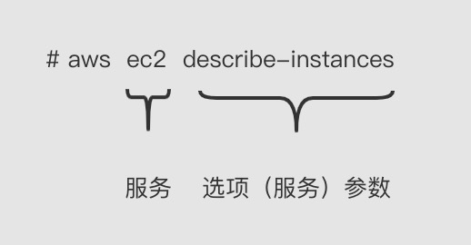

# AWS Command Line Interface

AWS Command Line Interface是一个统一的工具，可以与AWS的所有资源服务进行交互提供了一致的界面。

AWS CLI 是一种开源工具，让您能够在命令行 Shell 中使用命令与 AWS服务进行交互

-  linux shell

-  windows powershell

-  ec2 实例上（linux shell & windows powershell）


命令参考：

```
aws [options] <command> <subcommand> [parameters]
```



举个栗子：

```
➜  ~ aws s3 ls 
2021-04-06 22:52:23 advertising-images
```

