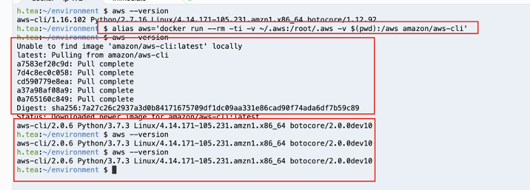

## AWS CLI v2 

注意：

> 我们通过 AWSCloud9启动一个编辑器进行测试
>
> 启动 Cloud9默认的 awscli 是v1版本
>
> 学习引用此视频
>
> https://www.youtube.com/watch?v=eBNOvEj0Gig&list=PLD6e3vg1Inj-bIMZB2KRCbfnJERiX_3Rj




```
alias aws='docker run --rm -ti -v ~/.aws:/root/.aws -v $(pwd):/aws amazon/aws-cli'
alias aws='docker run --rm -ti -v ~/.aws:/root/.aws -v $(pwd):/aws amazon/aws-cli:2.0.6' #指定版本
```

由于第一次执行需要下载 awscli docker image 
但是第二次 第三次执行就没有问题了

```
aws sts get-caller-identity
```


保证 awscli最新的版本
可以pull awscli 的 image

```shell
h.tea:~/environment $ docker pull amazon/aws-cli
Using default tag: latest
latest: Pulling from amazon/aws-cli
Digest: sha256:7a27c26c2937a3d0b84171675709df1dc09aa331e86cad90f74ada6df7b59c89
Status: Image is up to date for amazon/aws-cli:latest
h.tea:~/environment $
```